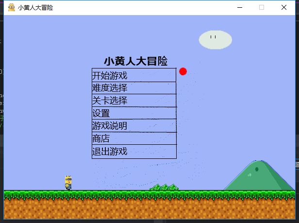
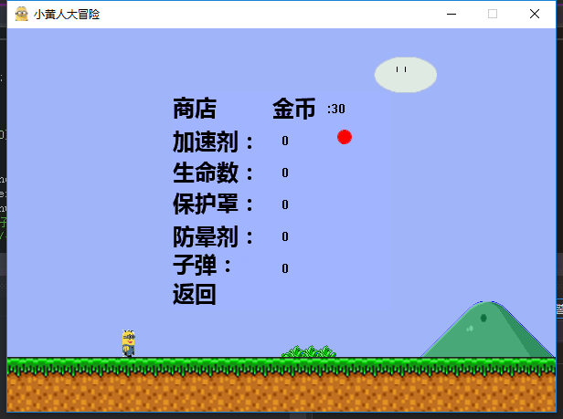
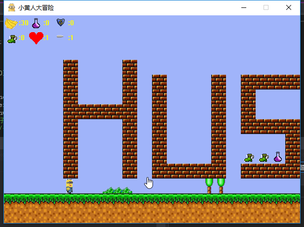
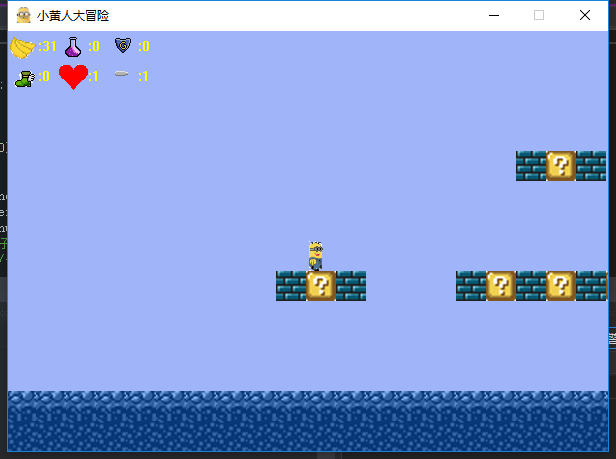
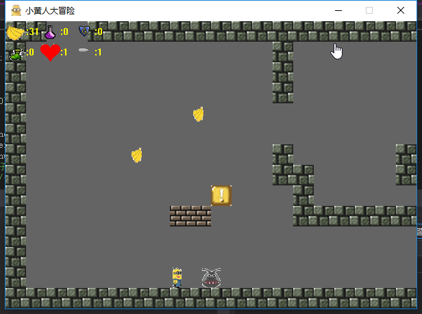
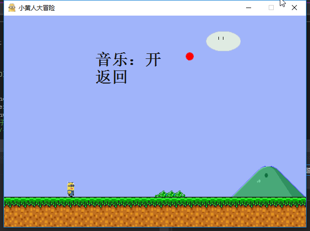

# **小黄人大冒险**  
## 目录  
* [背景介绍](#背景介绍)  
* [项目介绍](#项目介绍)  
* [使用说明](#使用说明)  
* [作者列表](#作者列表)
* [开发环境](#开发环境)
* [历史版本](#历史版本)

## 一、背景介绍  
2018年华中科技大学电气学院暑期软件工程训练营，4班第4组的学生团队合作项目。

## 二、项目介绍  
想必很多人的童年记忆都和游戏紧紧联系在一起，黄金矿工、吃豆人、坦克大战还有超级马里奥，这些小霸王系列令人怀念游戏将80/90年代的玩家全部记忆融合在一起，组成了童年记忆的一部分。我们团队基于对游戏的热爱，决定开发一款致敬超级玛丽的游戏。  

游戏形象基于经典动画形象“小黄人”改编，地图中的怪物也基于小黄人电影中的反派改编。玩家可以通过操作键盘上的方向键来让小黄人躲过怪物的阻拦到达终点。  

目前已完成大部分超级玛丽的功能，包括2D横版过关、金币系统、特殊功能道具系统等等，并创建了华科特色的地图。  
## 三、使用说明  
使用支持c++的软件运行，进入菜单
###   
1.难度可选，分为简单、中等、困难、疯狂四种，区分标准为野怪的移动速度、出现位置。  
2.商店系统中，玩家可以使用获得的金币购买一些增益buff及道具，增加游戏乐趣。
###   
3.有三个地图供玩家选择，每个地图各有不同
### 
### 
###   
4.背景音乐可设置播放或关闭。
###    
# 四、开发环境
使用Visual Studio 2017软件开发平台，运用c++语言开发。
# 五、历史版本  
* 小黄人大冒险
此版本为初版，实现基本的横版过关功能
* 小黄人大冒险2.0  
1.增加特殊功能道具：加速、致盲、生命数增加、保护罩  
2.可以使用金币购买道具，后期会增加商店  
3.随机宝箱中加入特殊道具  
4.更新地图  
* 小黄人大冒险3.0  
1.更新背景音乐，更新人物野怪的图标  
2.尝试加入商店系统  
3.加入子弹系统  
* 小黄人大冒险4.0  
1.更新背景音乐  
2.更新道具图标
* 小黄人大冒险5.0  
1.改进子弹系统，优化发射与购买操作  
* 小黄人大冒险6.0  
1.进行最后一步的优化
# 六、作者列表
    代码编写：彭特、陈岑
    人物与动作设计：卢沁书、黄博
    XML注释编写：孔向豪
    Readme撰写：张佑康 